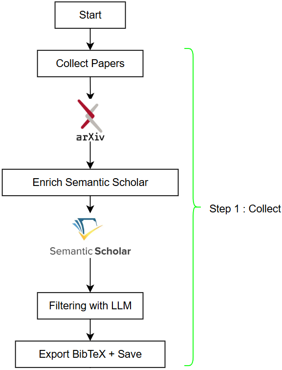
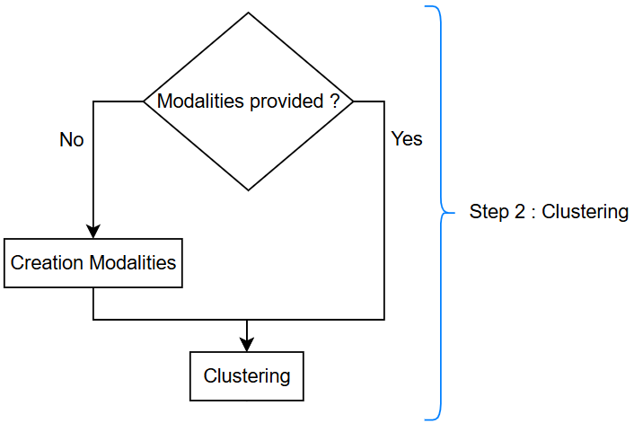
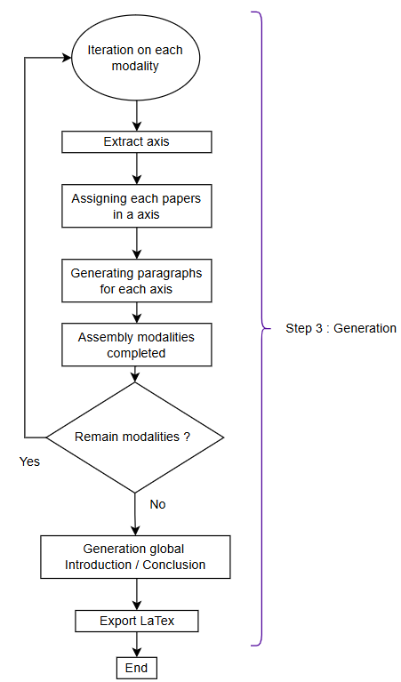
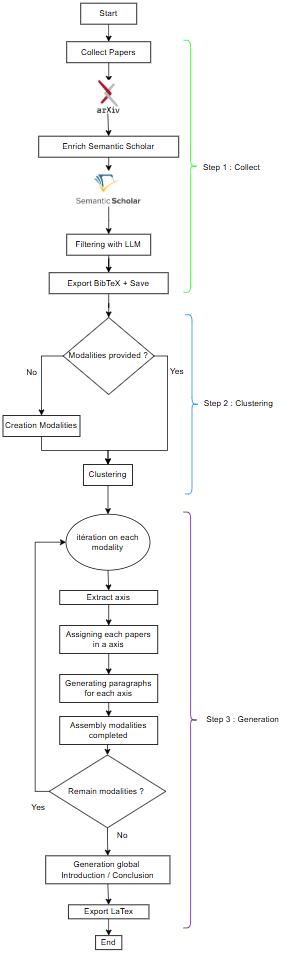

# End-of-Study Project

This Python project is an Automated State-of-the-Art Pipeline to generate a **State-of-the-Art (SoTA)** review from scientific papers (e.g., arXiv).  
It combines metadata retrieval, LLM-based structured reasoning, clustering, and axis-based organization into a fully automated research synthesis workflow.

---

The user is prompted to make the changes they wish to generate the SoTA as they want.

---

# Pipeline Architecture

The pipeline runs in **three main steps**:

---

## Step 1 — Paper Collection & Enrichment

**Goal:** Retrieve relevant scientific papers and enrich them with metadata.

### What happens:

1. Papers are retrieved via arXiv API and are stored as a class `Paper`.
2. arXiv IDs are normalized (`XXXX.XXXXX`, version removed).
3. Papers are enriched using Semantic Scholar:
   - Citation counts
   - Additional metadata
4. The `.bib` file is generated or updated.
5. URLs are extracted from `.bib` when needed.

### Output:
- Structured `Paper` objects
- A clean `.bib` file
- Metadata-ready dataset



---

## Step 2 — Clustering & Modalities Construction

**Goal:** Identify research modalities (clusters) dynamically.

### Key idea:
The system iterates article-by-article and progressively builds a list of modalities.

For each article:
- The LLM assigns it to an existing modality giving by user **or**
- Creates a new modality if necessary

This ensures:
- Consistency across articles
- No modality duplication
- Dynamic update of the modality list

### Output:
```json
{
  "step": "step2_clustering",
  "method": ...,
  "model": ...,
  "n_clusters": X,
  "n_papers": X,
  "modalities": [

  "NEURO_IMAGE": [...],
  "ARCHITECTURE_GENETIQUE": [...],
  ...
  ]
}
```



## Step 3 — State-of-the-Art Generation

Generating a high-quality State-of-the-Art (SoTA) requires structured reasoning.  
We **do not** provide all articles and clusters at once and ask a model to “write a review”.

Instead, we decompose the process into controlled sub-steps to ensure coherence, traceability, and structural consistency.

---

### 3.1 Extract Research Axes

Before generating text, we identify the **research axes** that structure the cluster.

An axis represents a conceptual research direction, such as:

- Clinical Decision Support
- Biomarker Discovery
- Multimodal Learning
- Model Interpretability

Axes are extracted from the cluster content using a constrained prompt.  
They must:

- Be conceptually distinct
- Cover the major research directions
- Avoid redundancy
- Use precise scientific wording

This step ensures that the SoTA is not a flat summary, but a structured synthesis.

---

### 3.2 Assign Articles to Axes

Each article is processed with:

- Its arXiv ID (`XXXX.XXXXX` format)
- Its structured summary
- The predefined list of axes

A validation layer guarantees:

- All input IDs are present
- No unknown IDs are returned
- No hallucinated axes appear
- Maximum 2 axes per article
- Missing assignments default to []
- This ensures deterministic downstream grouping:

---

### 3.3 Generate Paragraphs for Each Axis

For each research axis:
1. Retrieve the list of assigned articles
2. Provide their summaries to the model
3. Generate a structured synthesis paragraph

Each paragraph must:
- Compare approaches
- Identify methodological trends
- Highlight contributions
- Mention limitations when relevant
- Avoid article-by-article listing
- Maintain scientific tone
- This produces coherent sub-sections of the SoTA.

---

### 3.4 Generate the Global Synthesis
Once all axis-level sections are generated, the model produces:
- A cross-axis synthesis
- Emerging research trends
- Methodological patterns
- Open challenges
- Future research directions

This ensures the final document is not a collection of independent paragraphs, but a unified scientific narrative.

---

### 3.5 Generate the LaTeX Version
The final SoTA is exported as a LaTeX-ready document.
Key features:
- Citation protection during generation
- Clean formatting
- Automatic bibliography integration:



## Full Pipeline 


# Environment Setup

To use this repo, please ensure first:
1. Synchronize with _uv_ or create a Virtual Environment

It is commun to create a virtual environment for a python project. There is a tutorial to explain how do it. You can also use _uv_ to retrioeve our environment.

We recommand you use _uv_ to avoid any future transitive dependancy issues.

### Use _uv_
If not already install, install _uv_ :
```bash
curl -LsSf https://astral.sh/uv/install.sh | sh
```
Reload your terminal, then synchronize the with the project with : 
```bash
uv sync
```

### If you prefer working with a Virtual Environment :
```bash
python -m venv .venv
```
Then activate it:
- For macOS / Linux:
```bash
source .venv/bin/activate
```
- For Windows:
```bash
.venv\Scripts\activate
```
Then install dependencies
```bash
pip install -r requirements.txt
```

2. Configure Environment Variables
Create a .env file at the root of the project and indicates the API_KEY you use. You can find an example of a .env in the project

**Please note that you have to create account or install in local the provider you want to use.**

3. Choose your parameters in the main.py

Some recommendations :

`nb_paper`
- Avoid a too large number of paper to treat (10 are great). The more papers you take, the longer the pipeline will take. 

`batch_size`
- For **local models**, batching is unnecessary — there are no API rate limits or token quota issues.
  A value of `0` or `1` (sequential processing) is recommended.
- For **remote API models**, use a reasonable batch size to avoid timeouts or rate-limit errors.

`max_articles_per_generation`
- If your clusters contain a **large number of articles**, it is strongly recommended to set a low
  `max_articles_per_generation` (e.g. **5–10**).
- Feeding too many articles at once increases the risk of **hallucinations** and may cause the
  output format to break, crashing the pipeline.

Scholar citation retrieval
- Citation fetching via Semantic Scholar relies on its **free public API**, which is subject to
  rate limiting. Expect slower execution when `scholar_citation=True`, especially for large paper sets.

Custom clustering modalities
- To use your own modalities, define them and place/import them in the `modalities/user_modalities`
  folder, then pass them via the `user_modalities` parameter.


4. Run it.

For uv users :
```bash
uv run python main.py
```

otherwise :
```bash
python3 main.py
```

5. Find your results in the folder ```results```

# Uninstall the Environment

If you want to suppress the environment:
## clear _uv_

To suppress installation from _uv_
```bash
uv clean
```

## suppress virtual environment
Suppress the folder .venv
- for Linux/MAcOS 
```bash
rm -rf .venv
```
- for Window
```bash
rmdir .venv
```

# Future work
- **LLM-as-a-Judge output verification** — Complement the existing format-checking function with an
  LLM-based judge to validate paragraph quality and enforce output structure. This would also
  introduce generation metrics tied to each paragraph produced.
- **Parallel API calls** — Implement concurrency at the article-processing level to speed up the
  pipeline, applicable to remote API providers only (not local models).
- **Broader model & provider testing** — Evaluation has so far focused on provider ollama in local and Groq with the model `gemma3:4b` and `openai/gpt-oss-120b`. Testing
  across additional providers and models would help assess generalizability and robustness.